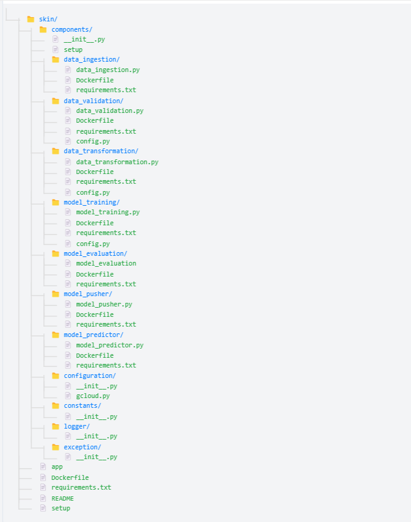

# Data-Engineering-Project-Big-Data

# This repository contains Microservices for Skin Segmentation Machine Learning Application: 



# Folder structure
=====================================
skin/
├── components/
│   ├── __init__.py
│   ├── setup
│   ├── data_ingestion/
│   │   ├── data_ingestion.py
│   │   ├── Dockerfile
│   │   └── requirements.txt
│   ├── data_validation/
│   │   ├── data_validation.py
│   │   ├── Dockerfile
│   │   ├── requirements.txt
│   │   └── config.py
│   ├── data_transformation/
│   │   ├── data_transformation.py
│   │   ├── Dockerfile
│   │   ├── requirements.txt
│   │   └── config.py
│   ├── model_training/
│   │   ├── model_training.py
│   │   ├── Dockerfile
│   │   ├── requirements.txt
│   │   └── config.py
│   ├── model_evaluation/
│   │   ├── model_evaluation
│   │   ├── Dockerfile
│   │   └── requirements.txt
│   ├── model_pusher/
│   │   ├── model_pusher.py
│   │   ├── Dockerfile
│   │   └── requirements.txt
│   ├── model_predictor/
│   │   ├── model_predictor.py
│   │   ├── Dockerfile
│   │   └── requirements.txt
│   ├── configuration/
│   │   ├── __init__.py
│   │   └── gcloud.py
│   ├── constants/
│   │   └── __init__.py
│   ├── logger/
│   │   └── __init__.py
│   └── exception/
│       └── __init__.py
├── app
├── Dockerfile
├── requirements.txt
├── README
└── setup


# Data Engineering Project - Docker Services

## Building and Running Docker Services

## Getting Started

### Prerequisites

Make sure you have the following software installed:
- [Docker](https://www.docker.com/get-started): For containerization
- [Python 3.7+](https://www.python.org/downloads/) (only required if modifying code or running outside of Docker)


### 1. Data Ingestion Service

#### Build the Docker Image
```bash
docker build -t data-ingestion-service -f skin/components/data_ingestion/Dockerfile .

#### Run the Data Ingestion Container
docker run -it --rm \
    --name data-ingestion-container-new \
    -v "${PWD}/key.json:/app/key.json:ro" \
    -v "${PWD}/artifacts:/app/artifacts" \
    -e GOOGLE_APPLICATION_CREDENTIALS=/app/key.json \
    -e GOOGLE_CLOUD_PROJECT=starlit-byway-436420-s9 \
    data-ingestion-service


Parameters Explained:
-it: Interactive terminal
--rm: Remove container after execution
--name: Container name
-v: Volume mounts
    key.json: Google Cloud credentials (read-only)
    artifacts: Output directory for processed data
-e: Environment variables
GOOGLE_APPLICATION_CREDENTIALS: Path to credentials inside container
GOOGLE_CLOUD_PROJECT: Your Google Cloud project ID


# Data Ingestion Service

## How to use this container

# just need to run this command:
docker pull waelr1985/data-ingestion-service:latest


1. Download your Google Cloud service account key as `key.json`

2. Run the container:
```bash
docker run -it --rm \
    --name data-ingestion-container-new \
    -v "/your/path/to/key.json:/app/key.json:ro" \
    -v "/your/path/to/artifacts:/app/artifacts" \
    -e GOOGLE_APPLICATION_CREDENTIALS=/app/key.json \
    -e GOOGLE_CLOUD_PROJECT=your-project-id \
    yourusername/data-ingestion-service


Requirements:

Docker installed
Google Cloud service account key
Access to Google Cloud Storage


### 2. Data Validation Service


### Building the Docker Image

To build the Docker image for the Data Validation Service, use the following command. Ensure that your working directory is `D:\Data-Engineering-Project-Big-Data`:

```bash
docker build -t data-validation-service -f skin/components/data_validation/Dockerfile .


This command:

Uses the Dockerfile located at skin/components/data_validation/Dockerfile.
Tags the image as data-validation-service.

Running the Docker Container
To run the Docker container with the Data Validation Service, execute:

docker run -it \
    -v "D:\Data-Engineering-Project-Big-Data\artifacts:/app/artifacts" \
    -v "D:\Data-Engineering-Project-Big-Data\config:/app/config" \
    --name data-validation data-validation-service

This command:

Creates a container named data-validation from the data-validation-service image.
Mounts the artifacts directory in the container at /app/artifacts to store validation reports and generated files.
Mounts the config directory in the container at /app/config to provide configuration files like data schemas and settings.
Runs the container interactively (-it) so you can see logs and validation messages.

Example Workflow
Build the Docker image (if not already built).
Run the container with the required volumes mounted.
Check the artifacts directory in your local machine for generated validation reports and logs.

Important Files
Dockerfile: Used to define the environment for the Data Validation Service.
data_validation.py: The main script that performs data validation tasks.
config/: Contains configuration files required by the service (e.g., schema files).

Additional Information

To stop the container:
docker stop data-validation

To remove the container
docker rm data-validation

To remove the image:
docker rmi data-validation-service

## How to use this container

# just need to run this command:
docker pull waelr1985/data-validation-service:latest


# Data Transformation Service

## Description
A Docker-based service that handles data transformation for skin dataset, including train/test splitting and data preprocessing.

## Build Instructions
Build the Docker image:
```bash
docker build -t data-transformation-service -f skin/components/data_transformation/Dockerfile .

Run Instructions
Run the container with volume mount:

docker run -v "D:/Data-Engineering-Project-Big-Data/artifacts:/app/artifacts" data-transformation-service


Docker Hub Instructions
Push to Docker Hub
Tag the image:

docker tag data-transformation-service waelr1985/data-transformation-service:latest


Login to Docker Hub:
docker login -u waelr1985

Push the image:
docker push waelr1985/data-transformation-service:latest


Pull from Docker Hub
To pull the image:

docker pull waelr1985/data-transformation-service:latest


## Model Training Service

### Build
```bash
docker build -t model-training-service -f skin/components/model_training/Dockerfile .

Run
docker run -v "D:/Data-Engineering-Project-Big-Data/artifacts:/app/artifacts" model-training-service

Push to Docker Hub
docker tag model-training-service waelr1985/model-training-service:latest
docker push waelr1985/model-training-service:latest

Pull from Docker Hub
docker pull waelr1985/model-training-service:latest


Model Evaluation Service


Build
docker build -t model-evaluation-service -f skin/components/model_evaluation/Dockerfile .


Run
docker run -v "D:/Data-Engineering-Project-Big-Data/artifacts:/app/artifacts" model-evaluation-service


Push to Docker Hub

docker tag model-evaluation-service waelr1985/model-evaluation-service:latest
docker push waelr1985/model-evaluation-service:latest

Pull from Docker Hub
docker pull waelr1985/model-evaluation-service:latest


Performance Metrics
The model achieves the following performance on the test set:
Accuracy: 97.23%
Precision: 97.32%
Recall: 97.23%
F1 Score: 97.26%


## Model Training Pusher Service
Build
docker build -t model-pusher-service -f skin/components/model_pusher/Dockerfile .

RUN
docker run -v "$(pwd)/artifacts:/app/artifacts" \
          -v "${PWD}/key.json:/app/key.json:ro"\
          -e GOOGLE_APPLICATION_CREDENTIALS=/app/key.json \
          -e GOOGLE_CLOUD_PROJECT=starlit-byway-436420-s9 \
          model-pusher-service


### Model Predictor Service

BUILD
docker build --no-cache -t model-predictor-service -f skin/components/model_predictor/Dockerfile .

RUN
docker run -d --name model-predictor -e GOOGLE_APPLICATION_CREDENTIALS=/app/credentials/key.json -v "D:\Data-Engineering-Project-Big-Data\key.json:/app/credentials/key.json" -v D:\Data-Engineering-Project-Big-Data\artifacts:/app/artifacts --env B=150 --env G=100 --env R=200 model-predictor-service

PUSH
docker tag model-predictor-service waelr1985/model-predictor:latest

docker push waelr1985/model-predictor:latest


PULL
docker pull waelr1985/model-predictor:latest


### app service

Build 
docker build -t app .

